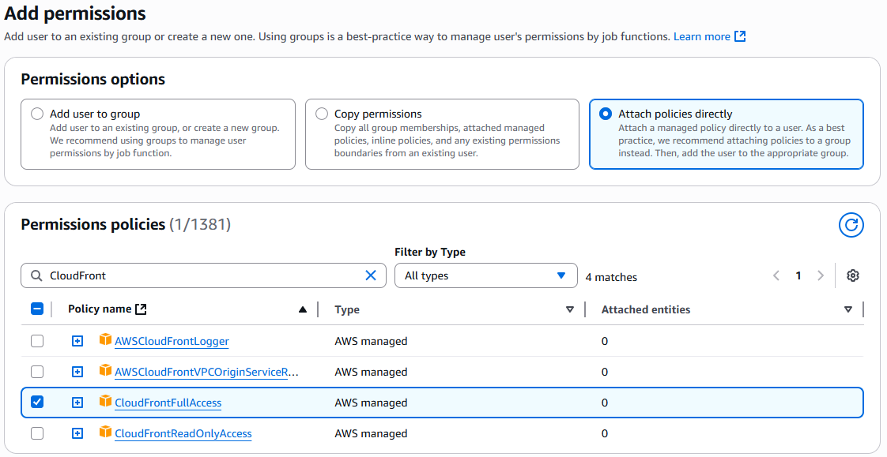

# AWS Setup

## Pre-Production
### Validation
In development, we start the server using `npm run dev` and validate that the application works as expected.

For production, we can run the server locally:
```bash
npm ci
npm run build
npm run preview
```

This builds the application code into the `dist` directory and serves it on port 5173. The port is selected to avoid CORS issues as by default 4173 is used. The port was set in the `package.json` file under the `preview` script.

The application should be accessible at [localhost:5173](http://localhost:5173) and will be calling the API as specified in the `.env.production` file (rather than `.env.development`).

This version of the application is what we will deploy to AWS.
### AWS Setup
### AWS CLI Installation
1. Install the AWS CLI: [AWS CLI v2 download page](https://docs.aws.amazon.com/cli/latest/userguide/getting-started-install.html)
2. Validate the installation with `aws --version`.
3. Configure the AWS CLI with your credentials `aws configure`. It will prompt for:
   - AWS Access Key ID - this is your access key ID from AWS IAM (IAM > Users > MyUsername > Summary > Access key 1).
   - Secret Access Key - This was generated when I created the access key in AWS IAM and stored in local records.
   - region - I used `eu-west-2` (London) as it is the closest region to me, matching the backend.
   - output format - I used `json` as it is the default and works well with the CLI.

### Create CloudFront with Origin Access Control (OAC)
Ensure IAM Policy for "CloudFrontFullAccess" is attached to the user or role that will be creating the CloudFront distribution via:

IAM > Users > MyUsername > Permissions > Add permissions > Attach policies directly > Search and attach it.:


### Create S3 Bucket
1. Go to S3 → Buckets → Create bucket
   - Name: tas-frontend-dev
   - Region: eu-west-2 (London)
   - Keep Block all public access = ON (use CloudFront, not public S3)
2. Click Create bucket
3. Upload the frontend build
4. Open the bucket → Upload
5. Add all files from `dist/` folder
6. Click Upload

### Create CloudFront Distribution
1. Go to CloudFront → Create distribution
   - Origin type: Amazon S3
   - Select bucket (tas-frontend-dev)
   - Enable: Restrict bucket access → CloudFront will create permissions
   - Default root object: `index.html`
   - Viewer protocol policy: Redirect HTTP to HTTPS
   - Caching: leave defaults (good for static assets)
2. Create the distribution
3. Wait for the distribution to deploy (status will change from "In Progress" to "Deployed")
4. Domain will be generated like: https://d2wje48k2823pv.cloudfront.net

### Deploy manually to S3
```bash
npm run build
aws s3 sync dist/ s3://tas-frontend-dev/ --delete
aws cloudfront create-invalidation --distribution-id ${DIST_ID} --paths "/*"
```

`build` regenerates the dist/ folder with your latest changes.
`--delete` ensures old assets that no longer exist are removed.
`create-invalidation` is used to clear the CloudFront cache so that the latest files are served.

Changes will then be live.

### Additional Commands
#### To ensure logged in 
`aws sts get-caller-identity`

#### List distributions
`aws cloudfront list-distributions --query "DistributionList.Items[].{Id:Id, Domain:DomainName}" --output table`

#### Get CloudFront domain
`aws cloudfront get-distribution --id $DIST_ID --query "Distribution.DomainName" --output text` - 
assumes `$DIST_ID` is set to the ID of the distribution you want to query. If not, use list distributions command to retrieve this value.